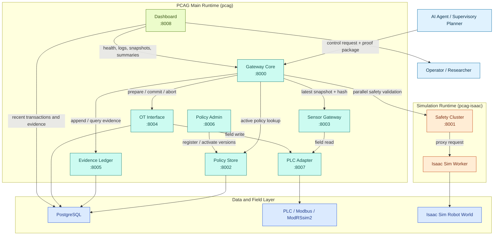
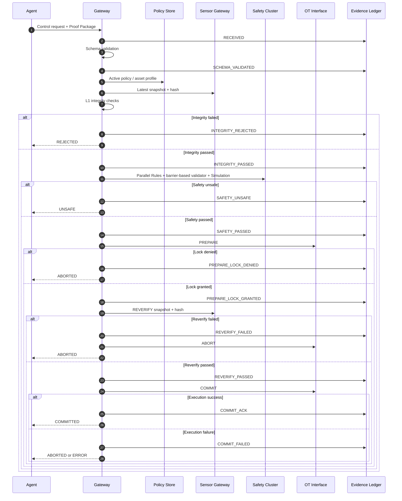

<div align="center">

# PCAG

### Proof-Carrying Action Gateway for Deterministic Safety Execution

PCAG is a deterministic safety gateway for AI-generated control commands in industrial and cyber-physical environments.
It accepts a control request only after integrity validation, multi-validator safety analysis, transactional execution control, and cryptographic evidence logging.

<p>
  
  
  
  
  
  
</p>

<p>
  <a href="#overview">Overview</a> |
  <a href="#architecture">Architecture</a> |
  <a href="#execution-model">Execution Model</a> |
  <a href="#services">Services</a> |
  <a href="#quick-start">Quick Start</a> |
  <a href="#running-evaluations">Evaluation</a> |
  <a href="#dashboard">Dashboard</a>
</p>

</div>

> [!IMPORTANT]
> PCAG is not just a validator. It is a fail-closed execution gateway that sits between an AI agent and the field layer, ensuring that a command is still policy-aligned, state-consistent, and safe at the instant of execution.

> [!NOTE]
> In this repository, a `proof package` is an operational evidence bundle used for runtime verification. It should not be interpreted as a classical formal proof artifact in the proof-carrying code sense.

## Overview

Large language models and autonomous agents are increasingly used to generate high-level commands for robots, PLC-connected assets, AGVs, and other operational technology endpoints.
The critical problem is not only whether a command looks reasonable, but whether it remains safe at the exact moment it reaches the actuation boundary.

PCAG addresses that gap by turning execution into a deterministic pipeline:

1. validate the request contract
2. verify policy alignment, freshness, and sensor integrity
3. evaluate safety with multiple validators
4. acquire execution authority through a transaction-style control path
5. record an auditable evidence chain

The result is a research-grade but operationally runnable microservice stack for supervisory control in manufacturing and cyber-physical systems.

## Research At a Glance

<table>
  <tr>
    <td width="25%">
      <strong>Problem</strong><br/>
      AI-generated commands can drift away from current plant state between planning and execution.
    </td>
    <td width="25%">
      <strong>Core Idea</strong><br/>
      Wrap execution in integrity checks, safety consensus, transactional control, and immutable evidence.
    </td>
    <td width="25%">
      <strong>Operational Guarantees</strong><br/>
      Reject stale or inconsistent inputs, abort on reverify mismatch, commit only after successful execution.
    </td>
    <td width="25%">
      <strong>Reference Assets</strong><br/>
      Reactor, robot arm with Isaac Sim, and AGV with discrete-event simulation.
    </td>
  </tr>
</table>

## What PCAG Implements

PCAG currently includes:

- a `Proof Package` request contract for control submissions
- `L1 integrity` checks for policy version, timestamp freshness, sensor divergence, and `sensor_snapshot_hash`
- parallel `Rules + barrier-based validator (CBF-style static margin) + Simulation` safety validation with SIL-aware consensus
- Isaac-based robot validation for joint limits, workspace limits, torque limits, command divergence, and optional policy-driven fixture collision probes
- fail-closed `PREPARE -> REVERIFY -> COMMIT/ABORT` execution control
- `COMMITTED` only after successful execution, never before
- an append-only evidence ledger with hash-chain verification and fail-hard append semantics
- a centralized `PLC Adapter` so field I/O is not scattered across services
- a live operational dashboard backed by real services, database state, and logs
- dataset-driven mock E2E and live E2E evaluation suites

## Why This Repository Is Different

PCAG combines three concerns that are often separated in practice:

| Concern | Typical Gap | PCAG Response |
| --- | --- | --- |
| Command semantics | The command is syntactically valid but operationally naive | Strict request contracts and policy-aware proof packages |
| State-dependent safety | A command may be safe in one state and unsafe in another | Parallel Rules, barrier-based validation, and Simulation with consensus |
| Execution semantics | A command can become unsafe between validation and actuation | `PREPARE`, `REVERIFY`, `COMMIT/ABORT`, and evidence-backed fail-closed behavior |

For paper-oriented readers, this is the key contribution of the repository.
PCAG is not only "another safety classifier"; it is a deterministic execution gateway around AI-generated supervisory commands.

## Architecture

The implementation is intentionally split across two Python environments:

- `pcag` for the main runtime and field-facing services
- `pcag-isaac` for the simulation stack and Isaac worker isolation

### System Architecture



### Execution Model

The request path is intentionally deterministic and fail-closed.



## Services

| Service | Port | Responsibility |
| --- | --- | --- |
| `gateway` | 8000 | Orchestrates the full safety pipeline |
| `safety_cluster` | 8001 | Runs Rules, barrier-based validation, Simulation, and consensus |
| `policy_store` | 8002 | Serves active policy versions and asset profiles |
| `sensor_gateway` | 8003 | Provides live asset snapshots and hashes |
| `ot_interface` | 8004 | Handles `PREPARE`, `COMMIT`, `ABORT`, and `E-Stop` |
| `evidence_ledger` | 8005 | Stores append-only evidence events |
| `policy_admin` | 8006 | Registers and activates policy versions |
| `plc_adapter` | 8007 | Centralized field I/O path for PLC/Modbus assets |
| `dashboard` | 8008 | Live operational monitoring UI and snapshot APIs |

## Reference Scenarios

The reference implementation currently includes three scenario families:

| Scenario | Asset | Main Backend | Intended Role |
| --- | --- | --- | --- |
| Chemical process supervision | `reactor_01` | ODE-based simulation | deterministic process safety benchmark |
| Robot-arm supervision | `robot_arm_01` | Isaac Sim | high-fidelity digital-twin validation |
| AGV supervision | `agv_01` | discrete-event simulation | cell logistics and route safety |

For manufacturing-paper positioning, the strongest story is the robot-arm + AGV + PLC manufacturing-cell path.

The public repository should be read as a hybrid validation artifact:

- live service orchestration and evidence logging
- live PLC-adapter-backed sensor and actuation paths for reactor and AGV scenarios
- Isaac-Sim-backed robot validation

For the current robot path, the Isaac validator is best described as a digital-twin safety check rather than a task-success evaluator.
It is used to detect unsafe execution signals such as joint-limit violations, workspace exit, excessive effort, divergence between commanded and realized joints, and policy-declared forbidden fixture penetration.
- some mock-backed execution paths that remain intentionally explicit in the reference stack, especially for robot actuation

## Repository Layout

```text
pcag/
  apps/        # FastAPI microservices
  core/        # contracts, models, shared logic, middleware
  plugins/     # executors, sensors, simulation backends
config/        # service URLs and asset mappings
scripts/       # service runners, seeding, diagnostics
tests/         # unit, integration, mock E2E, live E2E
docker/        # database stack
```

Additional module-level documentation is available in:

- [`config/README.md`](config/README.md)
- [`pcag/README.md`](pcag/README.md)
- [`scripts/README.md`](scripts/README.md)
- [`tests/README.md`](tests/README.md)

## Runtime Environments

PCAG uses two Python environments by design.

### `pcag`

Main runtime for:

- Gateway
- Policy Store
- Sensor Gateway
- OT Interface
- Evidence Ledger
- Policy Admin
- PLC Adapter
- Dashboard

### `pcag-isaac`

Separate runtime for:

- Safety Cluster
- Isaac Sim worker

This split is intentional.
Isaac Sim has runtime constraints that are easier to manage when isolated from the rest of the stack.

## Prerequisites

- Python 3.13 for the main runtime
- PostgreSQL 16
- Docker Desktop or Docker Engine for local database startup
- NVIDIA Isaac Sim 4.5 for the robot simulation path
- Windows PowerShell commands are shown below because that is the primary development environment in this repository

## Installation

### Main environment

```powershell
conda create -n pcag python=3.13 -y
conda activate pcag
pip install -e .
pip install fastapi uvicorn httpx sqlalchemy numpy scipy simpy python-dotenv
```

### Isaac environment

```powershell
conda create -n pcag-isaac python=3.10 -y
conda activate pcag-isaac
pip install -r requirements-isaac.txt
```

> [!NOTE]
> The Isaac environment assumes Isaac Sim libraries are already available in that environment. The repository uses `pyproject.toml` for the minimal package definition, while some operational dependencies are still installed explicitly for local service execution.

## Quick Start

### 1. Start PostgreSQL

```powershell
docker compose -f docker/docker-compose.db.yml up -d
```

### 2. Start the Safety Cluster in `pcag-isaac`

```powershell
conda activate pcag-isaac
python scripts/start_safety_cluster.py
```

### 3. Start the remaining services in `pcag`

```powershell
conda activate pcag
python scripts/start_services.py
```

### 4. Seed the initial policy set

```powershell
python scripts/seed_policy.py
```

### 5. Open the service docs and dashboard

- Gateway docs: [http://127.0.0.1:8000/docs](http://127.0.0.1:8000/docs)
- Dashboard: [http://127.0.0.1:8008/](http://127.0.0.1:8008/)

## Running Evaluations

### Mock document-conformance evaluation

This suite validates gateway semantics without requiring the full live stack.

```powershell
python tests/e2e/run_document_conformance_eval.py
```

### Live gateway evaluation

This suite sends a single request to the live Gateway and lets the real services execute the rest of the pipeline.

```powershell
python tests/e2e/run_live_gateway_eval.py
```

### Repeated live evaluation

Use this to estimate stability, pass rate, and loss rate across repeated runs.

```powershell
python tests/e2e/run_live_gateway_eval_repeat.py --runs 10
```

See also:

- [`tests/e2e/README_document_conformance_eval.md`](tests/e2e/README_document_conformance_eval.md)
- [`tests/e2e/README_live_gateway_eval.md`](tests/e2e/README_live_gateway_eval.md)

## Dashboard

The repository includes a live monitoring dashboard backed by real services, PostgreSQL state, operational logs, and evaluation outputs.

Main UI:

- [http://127.0.0.1:8008/](http://127.0.0.1:8008/)

Main endpoints:

- `GET /v1/health`
- `GET /v1/snapshot`
- `GET /v1/stream`

The dashboard is not a static mock.
It reads:

- service health
- recent transactions
- evidence chains
- PLC adapter state
- asset snapshots
- live evaluation summaries
- operational logs

## Example Control Request

PCAG is designed so that clients submit a request with a `proof_package`.
A minimal example looks like this:

```json
{
  "transaction_id": "demo-tx-001",
  "asset_id": "reactor_01",
  "proof_package": {
    "schema_version": "1.0",
    "policy_version_id": "v2025-03-06",
    "timestamp_ms": 1773718800000,
    "sensor_snapshot_hash": "0123456789abcdef0123456789abcdef0123456789abcdef0123456789abcdef",
    "sensor_reliability_index": 0.95,
    "action_sequence": [
      {
        "action_type": "set_heater_output",
        "params": {
          "value": 60
        }
      }
    ],
    "safety_verification_summary": {
      "checks": [],
      "assumptions": [],
      "warnings": []
    }
  }
}
```

In practice, the live dataset runners generate many of the dynamic fields automatically from the running system.

## Verification Focus

The repository currently emphasizes two complementary validation modes:

- **mock semantic conformance**
  - verifies reject, unsafe, abort, and evidence behavior against expected gateway semantics
- **live gateway execution**
  - validates the real service stack with actual HTTP interfaces and runtime state

This keeps the project useful both as:

- a research artifact for deterministic safety execution
- an operational prototype that can be run end-to-end

The evaluation story is intentionally split:

- `mock` runners verify semantic edge cases and hard-to-stage failure modes
- `live` runners verify the actual microservice stack and runtime evidence flow
- the overall repository is therefore best described as a reproducible hybrid execution-assurance artifact rather than a single-mode deployment package

## Notes for Public Readers

- internal design notes and paper-planning documents are not required to understand the tracked repository
- the source tree is the primary reference artifact
- some local-only planning materials may exist outside the public repository structure

## License

This project is released under the [MIT License](LICENSE).
