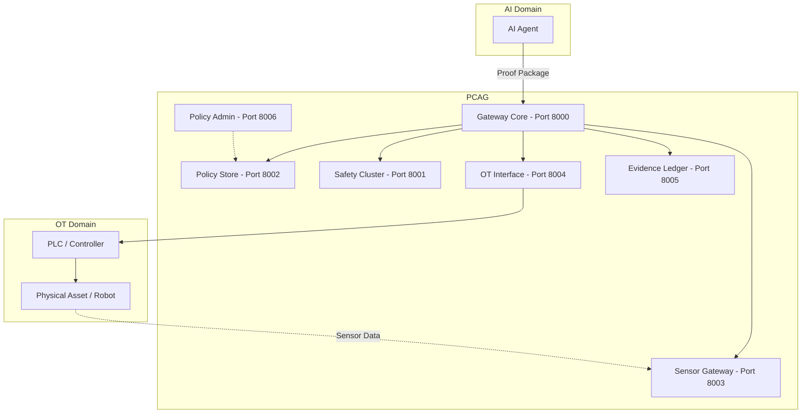

<div align="center">
  <h1>🛡️ PCAG: Proof-Carrying Action Gateway</h1>
  <p><strong>A Deterministic Safety Verification Gateway for AI Agent Control Commands in Industrial OT Environments</strong></p>
  
  <p>
    <a href="#"></a>
    <a href="#"></a>
    <a href="#"></a>
    <a href="#"></a>
    <a href="#"></a>
    <a href="#"></a>
  </p>
</div>

## 1. Abstract

The **Proof-Carrying Action Gateway (PCAG)** is a deterministic safety verification gateway designed to secure AI agent control commands before they are executed in operational technology (OT) environments. As autonomous AI systems are increasingly integrated into critical infrastructure, the risk of non-deterministic, unsafe actions becomes a paramount concern. PCAG bridges the gap between probabilistic AI outputs and deterministic OT safety requirements.

By requiring agents to submit a "Proof Package" along with their control commands, PCAG enforces a rigorous, multi-stage verification pipeline. It checks schema validity, data integrity, and safety constraints using rules, Control Barrier Functions (CBFs), and predictive simulations, culminating in a robust 2-Phase Commit (2PC) execution and cryptographic evidence logging.

## 2. Key Features

- **🔒 Multi-Stage Safety Pipeline**: Enforces a strict 5-stage validation process ([100] Schema → [110] Integrity → [120] Safety → [130] 2PC → [140] Evidence).
- **⚖️ Dynamic Consensus Engine**: Evaluates safety using a SIL-based (Safety Integrity Level) consensus engine combining Rule-based checks, Control Barrier Functions (CBF), and Simulation-based predictions (AND, WORST_CASE, WEIGHTED modes).
- **⏱️ Time-of-Check to Time-of-Use (TOCTOU) Mitigation**: Employs a Two-Phase Commit (2PC) protocol with an intermediate Reverify step to ensure sensor data remains valid right before execution.
- **📜 Cryptographic Evidence Ledger**: Maintains an immutable hash chain of all verification steps and execution results for auditability and post-incident analysis.
- **🔌 Pluggable Architecture**: Supports diverse sensor sources, simulation backends (e.g., Isaac Sim, ODE Solvers, Discrete Event), and OT execution interfaces.

## 3. Architecture

PCAG operates as a suite of microservices, each handling a distinct segment of the safety verification lifecycle.



## 4. Pipeline Details

PCAG processes control requests through a deterministic 5-stage pipeline:

1. **[100] Schema Validation**: Verifies the structural integrity of the submitted Proof Package (schema version, timestamps, action sequences).
2. **[110] Integrity Verification**: Checks policy version alignment, timestamp freshness (e.g., max age 5000ms), and sensor divergence limits.
3. **[120] Safety Validation**: The Safety Cluster executes multiple validators in parallel:
    - **Rules Validator**: Verifies physical limits (thresholds, ranges).
    - **CBF Validator**: Evaluates mathematical safety boundaries (Control Barrier Functions).
    - **Simulation Validator**: Runs predictive simulations (e.g., using Isaac Sim).
    - **Consensus Engine**: Aggregates validator results based on asset SIL level.
4. **[130] 2PC Execution**:
    - **PREPARE**: Acquires an input suppression lock on the OT interface.
    - **REVERIFY**: Fetches the latest sensor snapshot to prevent TOCTOU vulnerabilities.
    - **COMMIT**: Forwards the validated action sequence to the physical asset.
5. **[140] Evidence Recording**: Appends the execution result to the cryptographically verifiable evidence ledger.

## 5. Supported Scenarios

PCAG is designed to protect diverse physical assets. The reference implementation includes three core scenarios:

| Scenario | Asset Type | SIL Level | Consensus Mode | Simulation Backend |
|----------|------------|-----------|----------------|--------------------|
| **Scenario A** | Chemical Reactor | SIL 2 | WEIGHTED | ODE Solver |
| **Scenario B** | Robot Arm (Franka) | SIL 2 | WEIGHTED | Isaac Sim (Physics) |
| **Scenario C** | AGV (Automated Guided Vehicle) | SIL 1 | WORST_CASE | Discrete Event |

## 6. Quick Start

### Prerequisites
- Python 3.10+
- PostgreSQL 16
- Optional: NVIDIA Isaac Sim 4.5.0 (for Scenario B physics simulation)

### Installation

1. Clone the repository:
   ```bash
   git clone https://github.com/your-org/pcag.git
   cd pcag
   ```

2. Install dependencies:
   ```bash
   pip install -r requirements.txt
   # For Isaac Sim support:
   # pip install -r requirements-isaac.txt
   ```

3. Set up the environment:
   ```bash
   cp .env.example .env
   # Configure database credentials in .env
   ```

### Running the System

1. Start all PCAG microservices:
   ```bash
   python scripts/start_services.py
   ```
   *(To launch the Safety Cluster with Isaac Sim environments, run `python scripts/start_safety_cluster.py` separately).*

2. Seed the initial policy data:
   ```bash
   python scripts/seed_policy.py
   ```

3. Run an end-to-end test scenario:
   ```bash
   pytest tests/e2e/test_three_scenarios.py -v
   ```

## 7. Project Structure

Below is the comprehensive directory tree showcasing all microservices, core logic, plugins, configurations, scripts, and test files within the project.

```text
pcag/
├── apps/                          # 7 Microservices
│   ├── gateway/                   # Gateway Core (port 8000)
│   │   ├── main.py               # FastAPI app + middleware setup
│   │   └── routes.py             # 5-stage pipeline orchestration
│   ├── safety_cluster/            # Safety Cluster (port 8001)
│   │   ├── main.py               # Isaac Sim preload + startup
│   │   ├── routes.py             # /v1/validate, /v1/simulation/state
│   │   ├── service.py            # Multi-validator orchestration + consensus
│   │   ├── isaac_worker.py       # Separate process for Isaac Sim (PhysX)
│   │   └── isaac_proxy.py        # Multiprocessing Queue bridge
│   ├── policy_store/              # Policy Store (port 8002)
│   │   ├── main.py               # FastAPI app setup
│   │   ├── routes.py             # CRUD for safety policies
│   │   ├── repository.py         # PostgreSQL JSON document storage
│   │   └── seed_data.py          # Initial policy seed configurations
│   ├── sensor_gateway/            # Sensor Gateway (port 8003)
│   │   ├── main.py               # FastAPI app setup
│   │   ├── config.py             # Sensor gateway specific configuration
│   │   └── routes.py             # Composite sensor source routing
│   ├── ot_interface/              # OT Interface (port 8004)
│   │   ├── main.py               # FastAPI app setup
│   │   ├── routes.py             # 2PC endpoints (prepare/commit/abort)
│   │   ├── service.py            # Persistent TX state machine
│   │   ├── repository.py         # PostgreSQL transaction storage
│   │   └── executor_manager.py   # Plugin-based executor factory
│   ├── evidence_ledger/           # Evidence Ledger (port 8005)
│   │   ├── main.py               # FastAPI app setup
│   │   ├── routes.py             # Append-only hash chain events
│   │   └── repository.py         # PostgreSQL evidence storage
│   └── policy_admin/              # Policy Admin (port 8006)
│       ├── main.py               # FastAPI app setup
│       └── routes.py             # Policy lifecycle management
├── core/                          # Core Business Logic
│   ├── contracts/                 # Pydantic API contracts
│   │   ├── admin.py              # Admin API contracts
│   │   ├── common.py             # Shared contract definitions
│   │   ├── evidence.py           # EvidenceAppendRequest
│   │   ├── gateway.py            # ControlRequest/ControlResponse
│   │   ├── ot_interface.py       # PrepareRequest/CommitRequest
│   │   ├── policy.py             # PolicyResponse
│   │   ├── safety.py             # ValidateRequest/ValidateResponse
│   │   └── sensor.py             # SensorSnapshotResponse
│   ├── services/                  # Safety verification engines
│   │   ├── rules_validator.py    # Deterministic rule checking
│   │   ├── cbf_validator.py      # Control Barrier Function (h(x) ≥ 0)
│   │   ├── consensus_engine.py   # AND/WEIGHTED/WORST_CASE consensus
│   │   ├── integrity_service.py  # Policy version + timestamp validation
│   │   └── tx_state_machine.py   # In-memory 2PC state machine (legacy)
│   ├── middleware/                # FastAPI middleware
│   │   ├── auth.py               # API Key authentication
│   │   └── logging_middleware.py  # Structured request/response logging
│   ├── database/                  # Database layer
│   │   ├── engine.py             # SQLAlchemy engine + session
│   │   └── models.py             # PolicyRecord, EvidenceRecord, TransactionRecord
│   ├── utils/                     # Utility functions
│   │   ├── canonicalize.py       # JSON canonicalization (sorted keys, 3-decimal floats)
│   │   ├── hash_utils.py         # SHA-256 hash chain
│   │   ├── config_loader.py      # YAML config with env var substitution
│   │   └── logging_config.py     # Structured logging formatter
│   ├── models/                    # Domain models
│   │   ├── common.py             # Rule, ConsensusConfig dataclasses
│   │   ├── evidence.py           # Evidence domain models
│   │   ├── policy.py             # Policy domain models
│   │   └── proof_package.py      # Proof Package domain models
│   └── ports/                     # Interface definitions (ports)
│       ├── simulation_backend.py  # ISimulationBackend interface
│       ├── sensor_source.py       # ISensorSource interface
│       ├── cbf_validator.py       # ICBFValidator interface
│       └── executor.py            # IExecutor interface
└── plugins/                       # Pluggable implementations
    ├── sensor/                    # Sensor data sources
    │   ├── modbus_sensor.py      # Modbus TCP register reading
    │   ├── isaac_sim_sensor.py   # Isaac Sim joint state reading
    │   └── mock_sensor.py        # Development-only mock data
    ├── simulation/                # Physics simulation backends
    │   ├── ode_solver.py         # Chemical reactor ODE (scipy RK45)
    │   ├── discrete_event.py     # AGV collision detection (SimPy)
    │   ├── isaac_backend.py      # Robot arm validation (PhysX)
    │   └── none_backend.py       # Fallback (INDETERMINATE)
    └── executor/                  # Equipment control plugins
        ├── modbus_executor.py    # Modbus TCP register writing
        └── mock_executor.py      # Development-only mock executor

config/
├── services.yaml              # Service URLs, auth keys (env var support)
├── sensor_mappings.yaml       # Sensor source routing + Modbus register maps
├── cbf_mappings.yaml          # Action parameter → sensor field mappings
├── executor_mappings.yaml     # Executor routing + safe state actions
└── README.md                  # Configuration documentation

scripts/
├── start_services.py          # Launch all 6 main services
├── start_safety_cluster.py    # Launch Safety Cluster (pcag-isaac env)
├── seed_policy.py             # Initialize policy data for 3 scenarios
├── stop_services.py           # Graceful shutdown
├── check_services.py          # Health check all services
├── test_gateway.py            # Test script for gateway endpoints
├── test_isaac_sensor.py       # Test script for Isaac Sim sensor integration
├── test_logging.py            # Test script for structured logging
├── test_persistent_tx.py      # Test script for persistent transactions
└── README.md                  # Scripts documentation

tests/
├── unit/                      # 17 unit test files (220+ tests)
├── integration/               # Pipeline mock + PostgreSQL tests
│   ├── test_pipeline_mock.py      # End-to-end mocked pipeline integration tests
│   └── test_postgres_integration.py # Real PostgreSQL integration tests
├── e2e/                       # End-to-end scenario tests
│   ├── test_all_scenarios.py      # 9 scenarios (3 assets × SAFE/UNSAFE/ERROR)
│   ├── test_franka_realworld.py   # Franka robot real-world action tests
│   ├── test_failhard_scenarios.py # Fail-hard error handling tests
│   ├── test_real_pipeline.py      # Tests targeting the real running microservices pipeline
│   ├── test_three_scenarios.py    # Standard 3 scenario tests
│   └── results/                   # JSON output logs from E2E test runs
├── isaac_sim/                 # Isaac Sim specific tests
│   ├── isaac_sim_server.py        # Isaac Sim test server execution
│   ├── test_isaac_sim_api.py      # Tests for Isaac Sim API bindings
│   ├── test_isaac_sim_basic.py    # Basic Isaac Sim environment tests
│   ├── test_isaac_sim_gui.py      # Tests involving GUI components
│   ├── test_isaac_sim_physics.py  # Physics engine validation tests
│   └── test_scenario_b_robot_arm.py # Scenario B robot arm specific tests
├── modbus/                    # Modbus communication tests
│   ├── test_modbus_executor.py    # Tests for Modbus executor plugin
│   └── test_modbus_sensor.py      # Tests for Modbus sensor plugin
└── README.md                  # Testing documentation
```

## 8. Configuration

System configurations are managed centrally in the `config/` directory using YAML files.

- `services.yaml`: Defines endpoints, ports, and execution modes for all 7 PCAG microservices.
- `cbf_mappings.yaml`: Maps asset IDs to specific Control Barrier Function mathematical constraints.
- `executor_mappings.yaml`: Maps physical assets to their respective OT command executors (e.g., Modbus, Mock).
- `sensor_mappings.yaml`: Defines data retrieval plugins for physical sensors.

## 9. Testing

The repository includes a comprehensive test suite covering unit tests, integration tests, and end-to-end (E2E) pipeline validations.

Run all tests:
```bash
pytest tests/
```

Run specific scenarios:
```bash
pytest tests/e2e/test_all_scenarios.py
```
*Expected Result:* All 220+ tests should pass, confirming deterministic pipeline execution and fail-closed safety semantics. Test results from E2E scenarios are saved in `tests/e2e/results/`.

## 10. API Reference

PCAG exposes REST APIs for system administration and agent interaction across its microservices. Key endpoints include:

- **Gateway Core (`:8000`)**:
  - `POST /v1/control-requests`: Submit a Proof Package for a control action.
- **Policy Store (`:8002`)**:
  - `GET /v1/policies/active`: Retrieve the currently active safety policy version.
- **Evidence Ledger (`:8005`)**:
  - `GET /v1/events/{transaction_id}`: Retrieve the cryptographic hash chain for a specific transaction.
- **Safety Cluster (`:8001`)**:
  - `POST /v1/validate`: Run deterministic and simulation-based safety verifications.
- **OT Interface (`:8004`)**:
  - `POST /v1/ot/prepare` & `POST /v1/ot/commit`: Drive the 2-Phase Commit execution.

*(Full OpenAPI documentation is automatically generated and available at `http://localhost:<PORT>/docs` for each running microservice.)*

## 11. Documentation and Design Plans

Comprehensive design documents, phase plans, and architectural specifications are located in:
- **`BaseDocs/`**: Contains core system specifications (`PCAG_full_operational_spec.md`), presentation slides, academic drafts, and phase briefings.
- **`plans/`**: Contains technical roadmaps, test documentation, schema definitions, and integration guides (e.g., `PCAG_System_Specification_v5.md`, `PCAG_IsaacSim_Integration_Guide.md`).

## 12. Citation

If you use PCAG in your research, please cite our paper:

```bibtex
@article{pcag2026,
  title={Proof-Carrying Action Gateway: A Deterministic Safety Verification Gateway for AI Agent Control Commands in Industrial OT Environments},
  author={Anonymous Authors},
  journal={TBD (Under Review)},
  year={2026}
}
```

## 13. License

This project is licensed under the MIT License - see the [LICENSE](LICENSE) file for details.

## 14. Acknowledgments

This research is supported by [Funding Agency / Grant Name]. We acknowledge the use of NVIDIA Isaac Sim for rigorous physics-based safety validation.
